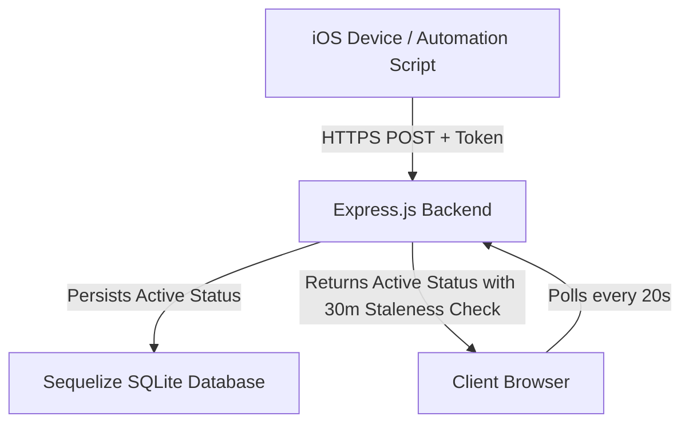

# Real-Time Live Activity Status (Dynamic Island) Integration

This document provides a comprehensive guide on the architecture, setup, API schema, and frontend mechanics of the **Real-Time Live Activity Status** (iOS-style Dynamic Island) integrated into your portfolio.

---

## 🛠️ Architectural Overview

The live status system connects your physical device activities (like coding, listening to music, or browsing) to your portfolio website in real time.



---

## 📂 Component Integration Breakdown

### 1. The Express.js Backend (`/backend`)
Handles incoming updates from your automation triggers and exposes the current status to the frontend.
* **Database Model (`activityStatus.model.ts`)**: Stores `statusLabel` (e.g. `Coding`), `appName` (e.g. `VS Code`), `icon` reference, `startedAt` timestamp, and `isActive` boolean flag.
* **Allowed Statuses Whitelist**: Prevents arbitrary inputs. Valid statuses include:
  * *Development*: `Coding`, `Debugging`, `Designing`, `Writing`, `In a Meeting`, `On a Call`, `Reviewing Code`
  * *Entertainment*: `Listening to Music`, `Watching Movies`, `Gaming`, `Scrolling Reels`, `Browsing`
  * *Lifestyle & Rest*: `Sleeping`, `Meditating`, `Coffee Break`, `Cooking`, `Offline`
* **Staleness Guard**: If no status updates are posted within **30 minutes**, the system automatically falls back to reporting `Offline`. This prevents your portfolio from showing you as "Coding" indefinitely if a script fails to report a session shutdown.

### 2. Client-Side Dynamic Island (`/frontend`)
Rendered as an interactive, floating **iOS-style Dynamic Island** widget positioned centrally below your navigation menu options.
* **Positioning & Navigation Clearance**:
  * Unscrolled: `top-[112px]`
  * Scrolled: `top-[80px]` (transitions smoothly via a `300ms ease-out` listener)
  * Keeps clear of navbar links so they remain hoverable and clickable.
* **Liquid Elastic Physics**: Uses `framer-motion` springs (`stiffness: 350, damping: 26, mass: 0.8`) to handle compact-to-expanded transitions, mimicking the organic look of iOS.
* **Dark Theme Noticeability & Ambient Halo**:
  * Outlines are styled with a `1px solid rgba(255,255,255,0.24)` border (brightens to `0.35` on hover).
  * Set on a matte `bg-zinc-950/98` translucent background.
  * Projects a **brand-colored ambient glow/halo** (Spotify Green, VS Code Blue, Instagram Pink, Steam Cyan, etc.) to lift the capsule off absolute dark page backgrounds.
* **Official Brand Vector Mapping**: Utilizes high-resolution official vector logos from `react-icons`:
  * Spotify -> `SiSpotify` (`#1DB954`)
  * VS Code -> `VscVscode` (`#007ACC`)
  * Instagram / Reels -> `SiInstagram` (`#E1306C`)
  * Gaming -> `SiSteam` (`#66C0F4`), `SiDiscord` (`#5865F2`), or `FaGamepad` (`#A855F7`)
  * Chrome -> `SiGooglechrome` (`#4285F4`)
  * Netflix / Youtube -> `SiNetflix` (`#E50914`) / `SiYoutube` (`#FF0000`)
  * Figma -> `SiFigma` (`#F24E1E`)

---

## 📡 API Endpoints

### 1. Update Status
* **Endpoint**: `POST /api/activity`
* **Headers**: `Content-Type: application/json`
* **Request Payload**:
  ```json
  {
    "statusLabel": "Coding",
    "appName": "VS Code",
    "icon": "terminal"
  }
  ```
* **Success Response (201 Created)**:
  ```json
  {
    "id": 12,
    "statusLabel": "Coding",
    "appName": "VS Code",
    "icon": "terminal",
    "startedAt": "2026-07-02T11:00:00.000Z",
    "isActive": true
  }
  ```

### 2. Fetch Active Status
* **Endpoint**: `GET /api/activity`
* **Success Response (200 OK)**:
  ```json
  {
    "statusLabel": "Coding",
    "appName": "VS Code",
    "icon": "terminal",
    "startedAt": "2026-07-02T11:00:00.000Z"
  }
  ```

---

## 📲 iOS Shortcut Integration (Real-Time iPhone Sync)

You can automatically sync your activity status from your iPhone using Apple **Shortcuts & Automations**:

### Step-by-Step Setup:
1. **Open Shortcuts App**: Create a new Shortcut called `Sync Spotify Status` (or similar).
2. **Add Actions**:
   * Add a **Dictionary** action:
     * Key `statusLabel` = `Listening to Music`
     * Key `appName` = `Spotify`
     * Key `icon` = `music`
   * Add a **Get Contents of URL** action:
     * Set URL to: `https://your-portfolio-domain.com/api/activity` (replace with your production URL).
     * Set Method to **POST**.
     * Add Header: `Content-Type` = `application/json`.
     * Set Request Body to **File** or **JSON** using the Dictionary output.
3. **Configure Automations**:
   * Go to the **Automation** tab in the Shortcuts app.
   * Create a **Personal Automation**:
     * Select **"When App Opens"** -> Choose `Spotify`.
     * Action -> Run your `Sync Spotify Status` shortcut.
   * Create a second Personal Automation:
     * Select **"When App Closes"** -> Choose `Spotify`.
     * Action -> Run a shortcut posting `{"statusLabel": "Offline"}` or let the 30-minute staleness guard clear it.

---

## 💻 Desktop Automation (PowerShell / Bash)

To sync your coding status from your desktop automatically, you can run a script that triggers whenever your editor is running. Under `/automation-scripts/check-coding-status.ps1`, a PowerShell daemon handles this:

```powershell
# Periodically queries active processes and syncs editor status
while ($true) {
    $vscode = Get-Process -Name "Code" -ErrorAction SilentlyContinue
    if ($vscode) {
        $body = @{
            statusLabel = "Coding"
            appName = "VS Code"
            icon = "terminal"
        } | ConvertTo-Json
        Invoke-RestMethod -Uri "http://localhost:4000/api/activity" -Method Post -Body $body -ContentType "application/json"
    }
    Start-Sleep -Seconds 60
}
```
