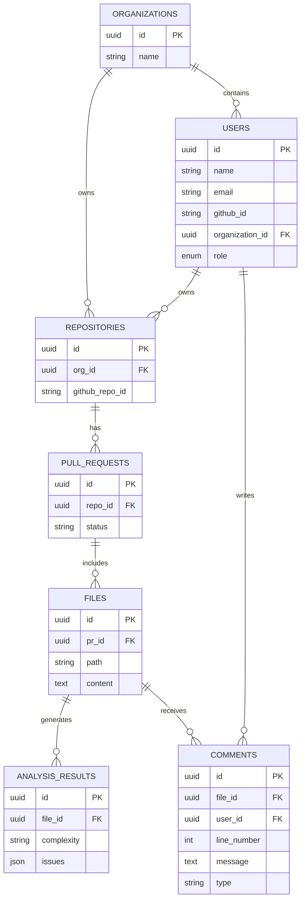

<div align="center">
  <h1>🚀 CodeSense AI</h1>
  <p><b>AST-powered code analysis and AI-driven code review platform</b></p>
  <p>
    <a href="https://github.com/Arya4546/codesense-ai/actions"></a>
    <a href="https://github.com/Arya4546/codesense-ai/blob/main/LICENSE"></a>
    <a href="https://nodejs.org/"></a>
    <a href="https://reactjs.org/"></a>
  </p>
</div>

## 📖 Overview

CodeSense AI is a next-generation repository intelligence platform that automates code review, detects architectural bottlenecks, and provides actionable AI-driven suggestions. Think of it as a senior engineer who automatically reviews your team's code in real-time.

By combining Abstract Syntax Tree (AST) parsing with Data Structures and Algorithms (DSA) complexity detection and Large Language Models (LLMs), CodeSense AI provides deep insights into your codebase, identifying inefficient loops, duplicate logic, and potential performance regressions.

### **How it works**
`Developer pushes code` → `GitHub Webhook / Action / CLI triggers analysis` → `Worker nodes parse AST & perform DSA complexity analysis` → `AI reviews the context` → `Dashboard displays interactive reports & inline comments`

---

## ✨ Key Features

### 🧠 AI Code Analysis
- **Deep Static Code Scanning:** Leverages AST parsing to understand the structure of your code, extracting functions, loops, and conditional structures.
- **Complexity Detection:** Automatically calculates Cyclomatic Complexity and Time Complexity (e.g., O(n²)).
- **Actionable AI Reviews:** Integrates with Gemini AI to explain bottlenecks, suggest optimizations, and provide refactored code snippets.
- **Duplicate Code Detection:** Identifies duplicate logic across your repository using Rabin-Karp hashing.

### 🐙 GitHub Integration
- **GitHub OAuth:** Seamless one-click authentication.
- **Webhook Automation:** Automatically triggers analysis on `push` and `pull_request` events.
- **Inline PR Comments:** Posts analysis results directly to GitHub PRs via the GitHub Action.

### 💻 CLI Tool
- **Local Analysis:** Run `codesense analyze` to scan files on your local machine before pushing.
- **Authentication:** Run `codesense login` to authenticate with your CodeSense AI account.
- **JSON Output:** Easily integrate CLI results into your existing bash scripts or CI pipelines.

### 📊 Interactive Dashboard
- **Real-Time Collaboration:** View and collaborate on reviews with WebSocket (Socket.io) powered live comments and typing indicators.
- **Code Viewer:** A rich file explorer and code viewer with inline comments and syntax highlighting.
- **Analytics & Trends:** Track complexity trends, repository health scores, and open issues across organizations.

### 🔐 Authentication & Security
- **JWT & OAuth:** Secure JWT-based authentication paired with GitHub OAuth.
- **Role-Based Access Control (RBAC):** `owner`, `admin`, `member`, and `viewer` roles at the organization level.
- **Robust Security:** Protected with Helmet headers, request rate-limiting, and strict CORS policies.

### 🐳 DevOps Features
- **Containerized Workloads:** Fully dockerized environment with `docker-compose` out of the box.
- **Redis Queueing:** Reliable job queueing for intensive AST parsing and AI tasks using BullMQ and Redis.
- **GitHub Actions:** Ready-to-use custom GitHub Action (`action.yml`) for instant CI/CD integration.

---

## 🛠 Tech Stack

| Domain | Technologies |
| --- | --- |
| **Frontend** | React 19, TypeScript, Vite, Tailwind CSS v4, Zustand, Recharts, Socket.io-client, Lucide React |
| **Backend** | Node.js, Express, Sequelize (ORM), PostgreSQL, Redis, Socket.io, BullMQ, Gemini AI SDK, Stripe |
| **CLI Tool** | Node.js, Commander.js, Chalk, Ora, CLI-Table3, Axios |
| **DevOps** | Docker, Docker Compose, GitHub Actions |

---

## 🏗 Complete System Architecture

```text
                     GitHub Repository
                            │
              ┌─────────────┴─────────────┐
              │                           │
       GitHub Webhook            GitHub Action / CLI Tool
              │                           │
              └─────────────┬─────────────┘
                            │
                     Backend API (Node.js)
                            │
              ┌─────────────┴─────────────┐
              │                           │
       Queue (Redis + BullMQ)      PostgreSQL Database
              │
          Worker Node
    ┌─────────┼─────────┐
    │         │         │
 AST Parser DSA Engine AI Service (Gemini)
    │         │         │
    └─────────┼─────────┘
              │
    WebSocket Layer (Socket.io)
              │
    React Dashboard (Vite + Zustand)
```

---

## 📂 Folder Structure

```
codesense-ai/
│
├── client/                 # React frontend application
│   ├── src/
│   │   ├── components/     # Reusable UI components
│   │   ├── pages/          # Application views (Home, Login, Repositories, etc.)
│   │   ├── store/          # Zustand state management
│   │   └── services/       # API communication layers
│
├── server/                 # Node.js Express backend API
│   ├── src/
│   │   ├── config/         # Environment and DB configuration
│   │   ├── routes/         # Express router definitions (v1)
│   │   ├── modules/        # Domain modules (Auth, User, Repo, Analysis)
│   │   ├── workers/        # BullMQ job processors
│   │   └── engine/         # AST Parsing and DSA complexity logic
│
├── cli/                    # Command Line Interface tool
│   ├── src/
│   │   └── commands/       # CLI commands (login, analyze)
│
├── vscode-extension/       # VS Code extension for inline analysis
│
├── .github/                # GitHub Action workflows
│
├── action.yml              # Custom GitHub Action definition
└── docker-compose.yml      # Orchestration for Postgres, Redis, Server, Client
```

---

## ⚙️ Backend Architecture

CodeSense AI follows a **modular, domain-driven** architecture to ensure maintainability and separation of concerns.

- **Routes:** Define API endpoints and delegate to controllers.
- **Controllers:** Handle HTTP request/response mapping and extract payloads.
- **Services:** Contain core business logic and interact with models/engines.
- **Middleware:** Handle authentication, rate-limiting, and error interception.
- **Engines:** Abstract complex logic (AST parser, AI SDK interactions, complexity calculation).

### Request Lifecycle

```text
Client Request
      │
   Routes (Express Router)
      │
 Middleware (Auth / Rate Limiting / Validation)
      │
 Controller (Extracts data, calls Service)
      │
 Service Layer (Business logic execution)
      │
 Database (Sequelize) / AI API (Gemini) / Redis Queue (BullMQ)
      │
   Response
```

---

## 🎨 Frontend Architecture

- **Component Structure:** Function-based React components using modern hooks.
- **Routing:** Handled via `react-router-dom` for declarative navigation between Dashboards, Settings, and Review views.
- **State Management:** `Zustand` is used for lightweight, fast global state (e.g., auth state, active repositories).
- **Styling:** `Tailwind CSS v4` provides utility-first styling for a responsive, theme-aware, and highly polished UI.
- **Real-Time Data:** `socket.io-client` syncs comments, typing indicators, and review progress live.

---

## 💻 CLI Architecture

The CLI enables developers to run the CodeSense engine locally without pushing code, catching bottlenecks early in the development lifecycle.

### Execution Flow
```text
Terminal
   │
CLI command (`codesense analyze .`)
   │
Authentication Check (Reads local config/JWT)
   │
Local Repository Scan (Filters by extensions)
   │
Backend Upload (Sends files to API)
   │
AI Analysis (Returns complexity & AI insights)
   │
JSON / Table Output Rendered
```

---

## 🐙 GitHub Action Usage

Integrate CodeSense directly into your CI/CD pipelines.

Create a file at `.github/workflows/codesense.yml`:

```yaml
name: Code Review
on: [pull_request]

jobs:
  analyze:
    runs-on: ubuntu-latest
    steps:
      - uses: actions/checkout@v4
      - name: Run CodeSense AI Analysis
        uses: Arya4546/codesense-ai@main
        with:
          api-url: 'https://api.yourcodesense.com/v1'
          api-token: ${{ secrets.CODESENSE_API_TOKEN }}
          extensions: 'ts,js,tsx,jsx'
          path: '.'
```

---

## 🔑 Environment Variables

### Client (`client/.env`)
```env
VITE_API_URL=http://localhost:5000/api/v1
```

### Server (`server/.env`)
```env
# Server Config
PORT=5000
NODE_ENV=development
CLIENT_URL=http://localhost:5173

# PostgreSQL Database
DB_HOST=localhost
DB_PORT=5432
DB_NAME=codesense_ai
DB_USER=postgres
DB_PASSWORD=your_password_here

# Redis
REDIS_HOST=localhost
REDIS_PORT=6379

# GitHub OAuth
GITHUB_CLIENT_ID=your_client_id
GITHUB_CLIENT_SECRET=your_client_secret
GITHUB_CALLBACK_URL=http://localhost:5000/api/v1/github/callback

# Security & AI
JWT_SECRET=your_jwt_secret_here
JWT_EXPIRES_IN=7d
GEMINI_API_KEY=your_gemini_api_key

# Billing (Optional)
STRIPE_SECRET_KEY=sk_test_...
STRIPE_PRO_PRICE_ID=...
STRIPE_WEBHOOK_SECRET=whsec_...
```

---

## 🚀 Installation Guide

### Prerequisites
- Node.js >= 20.0
- Docker & Docker Compose
- PostgreSQL (if not using Docker)
- Redis (if not using Docker)

### Local Development Setup

1. **Clone the repository**
```bash
git clone https://github.com/Arya4546/codesense-ai.git
cd codesense-ai
```

2. **Start Backend Server**
```bash
cd server
npm install
cp .env.example .env # Edit with your credentials
npm run dev
```

3. **Start Frontend Client**
```bash
cd client
npm install
npm run dev
```

4. **Install CLI Globally (Optional)**
```bash
cd cli
npm install
npm run build
npm link
```

---

## 🐳 Docker Deployment

The fastest way to spin up the entire stack locally is via Docker Compose.

```bash
docker compose up -d
```

**What this provisions:**
- `codesense-postgres`: PostgreSQL database (Port 5432)
- `codesense-redis`: Redis instance for job queues (Port 6379)
- `codesense-server`: Node.js Backend API (Port 5000)
- `codesense-client`: Vite React Frontend (Port 80)

---

## 📡 API Documentation

### Core Endpoints

| Method | Endpoint | Description | Auth Required |
| :--- | :--- | :--- | :---: |
| `POST` | `/api/v1/auth/login` | Authenticate and retrieve JWT | No |
| `GET` | `/api/v1/github/callback` | GitHub OAuth callback handler | No |
| `GET` | `/api/v1/user/me` | Get current authenticated user | Yes |
| `GET` | `/api/v1/repositories` | List connected repositories | Yes |
| `POST` | `/api/v1/github/webhook` | Incoming GitHub Webhook handler | No |
| `POST` | `/api/v1/analyses` | Trigger manual code analysis | Yes |
| `GET` | `/api/v1/analyses/:id` | Retrieve specific analysis report | Yes |
| `POST` | `/api/v1/analyses/:id/comments` | Add a comment to an analysis | Yes |
| `GET` | `/api/v1/analytics/overview` | Fetch repository health & trends | Yes |

---

## 🗄️ Database Design



---

## 🔄 Important Workflows

1. **User Onboarding Flow:** User clicks "Login with GitHub" → OAuth dance → Backend provisions `User` record → JWT returned → User redirected to dashboard.
2. **Repository Analysis Flow:** GitHub push event → Webhook hits backend → `analyze_repo` job pushed to Redis → Worker parses AST & calculates DSA complexity → Worker fetches AI insights from Gemini → Results saved to Postgres.
3. **AI Review Flow:** Developer views PR on dashboard → Backend fetches AI-generated `Analysis Results` → Contextual suggestions rendered inline with code.
4. **CLI Workflow:** Developer runs `codesense analyze` → Files hashed and sent to backend → Real-time processing via WebSocket/Polling → Report printed in terminal.

---

## 🛡️ Security

- **Authentication:** Stateless JWT-based authentication for API, combined with secure HTTP-only cookies for sessions where applicable.
- **Token Handling:** GitHub Access tokens are encrypted at rest.
- **Environment Variables:** Secrets managed via `.env` files; never committed to source control.
- **API Protection:** Global rate limiting (express-rate-limit) prevents brute-force. Large payload limits protect against DDoS.
- **Validation:** Strong runtime payload validation using `zod` and schema sanitization.

---

## 🚢 Deployment Guide

For production environments:

1. **Frontend:** Build the Vite app (`npm run build`) and host on Vercel, Netlify, or an NGINX container.
2. **Backend:** Deploy the Node API via Docker onto AWS ECS, Render, or Railway. Ensure `NODE_ENV=production`.
3. **Database:** Use a managed PostgreSQL instance (e.g., AWS RDS, Supabase, Neon).
4. **Redis:** Use a managed Redis instance (e.g., Upstash, ElastiCache) to handle job queues robustly.

---

## 🔮 Future Improvements

- **Broader Language Support:** Expand AST parsers to natively support Python, Go, and Rust.
- **Multiple AI Providers:** Support switching between OpenAI, Anthropic Claude, and local open-source models (Llama 3).
- **Advanced Analytics:** Heatmaps for most modified/complex files over time.
- **Team Collaboration:** Fine-grained code owner approvals and branch protection rules integration.
- **Enterprise Features:** SSO/SAML integration, on-premise deployment helm charts, and custom LLM fine-tuning.

---

## 🤝 Contributing Guide

We welcome contributions!

1. **Fork** the repository
2. **Branch** (`git checkout -b feature/amazing-feature`)
3. **Commit** using conventional commits (`git commit -m "feat: add amazing feature"`)
4. **Push** (`git push origin feature/amazing-feature`)
5. **Open a Pull Request** against the `main` branch.

---

## 📄 License

This project is licensed under the **ISC License**. See the [LICENSE](LICENSE) file for details.
