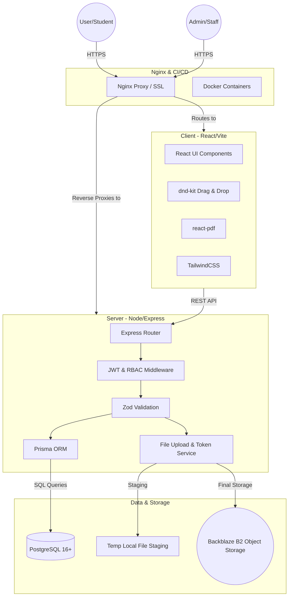

# STEMmantra Learning Management System (LMS)


> **An enterprise-grade, Multi-Tenant Learning Management System tailored for modern STEM education.**

Welcome to the STEMmantra LMS! This platform is built from the ground up to support comprehensive STEM education pipelines. It features robust multi-school tenancy, granular role-based access control, strict content protection mechanisms, and a powerful dynamic assessment engine. 

This document serves as the absolute, single source of truth for the entire system (Frontend, Backend, Architecture, API, and Deployment).

---

## 🏗 System Architecture

The STEMmantra LMS utilizes a modern, decoupled Client-Server architecture designed for high availability, transactional safety, and stringent security.



### 🛠 Tech Stack
| Component | Technology | Version / Details |
|-----------|------------|-------------|
| **Frontend Runtime**| React 18, Vite, TypeScript | Fast, strictly typed client utilizing `lucide-react` for icons and `@dnd-kit` for interactive dragging interfaces. Styled beautifully with **TailwindCSS**. |
| **Backend Runtime** | Node.js 18+, Express 5 | High-performance asynchronous backend. Native async error handling. |
| **Validation** | Zod | Used on the backend for request validation (body, query, params) instead of class-validator for better inference. |
| **Database** | PostgreSQL 16+, Prisma ORM | Relational data management ensuring referential integrity via Prisma. BigInt used for file sizes to prevent overflow on >2GB videos. |
| **Storage** | Local FS + Backblaze B2 | Hybrid storage model. Files are staged locally, DB transactions are confirmed, then pushed to permanent object storage. |
| **Security** | JWT, bcrypt, Helmet | Access (15m) + Refresh (7d) token rotation. Role-based middleware. |
| **Deployment**| Docker, GitHub Actions | Fully containerized environment orchestratable via `docker-compose.yml`. |

---

## 🧩 Core Platform Features

### 1. Multi-Tenant Architecture (Schools)
The LMS supports complete data isolation through "Schools". Users can belong to multiple schools with different roles in each.
- **Tenant Entities:** Categories, Courses, Enrollments, and Question Banks are strictly scoped to a specific `schoolId`.
- **Platform Admins:** Super Admins and Innovation Engineers can navigate globally across all tenants.

### 2. Granular Role-Based Access Control (RBAC)
9 strict roles define capabilities within the system:
- `SUPER_ADMIN` / `INNOVATION_ENGINEER`: Global platform control.
- `MANAGER` / `COURSE_CREATOR` / `COORDINATOR`: Course and curriculum management.
- `SCHOOL_ADMIN` / `TEACHER`: Tenant-scoped user and course administration.
- `STUDENT`: Read-only access to enrolled content and execution of assessments.

### 3. Assessment & Quiz Engine
A highly dynamic evaluation system catering to both formative and summative assessments.
- **Question Banks:** Reusable repositories to quickly assemble tests.
- **Question Types:** Multiple Choice, True/False, Short Answer, and File Upload.
- **Modes:** 
  - *Proctored Assessments:* Strictly timed, blur/tab-switch tracking.
  - *Independent Assessments:* Self-paced with recurrence logic for continuous practice.

### 4. Deletion Request Workflow
To prevent accidental data loss in an educational environment, destructive actions (like deleting a Course or School) trigger a `Deletion Request`. An administrator must review and explicitly approve the request before the data is soft-deleted.

---

## 🛡️ Content Protection & Storage

Content (videos, PDFs, images) is **never** served through direct file URLs. The protection flow is robust to prevent hotlinking and unauthorized downloads:

1. **Student requests a content access token** → `POST /api/content/:id/access-token`
   - Server verifies JWT auth + course enrollment.
   - Creates a single-use, 5-minute token in the DB.
   - Returns the token string.
2. **Student uses the token to access content** → `GET /api/content/serve/:token`
   - Server validates token (exists, not used, not expired).
   - Marks token as used (single-use).
   - Logs access (userId, contentItemId, IP, userAgent, timestamp).
   - Validates `Referer` header against allowed origins to block hotlinking.
   - Serves file with strict anti-download headers:
     - `Content-Disposition: inline` (never `attachment`)
     - `X-Content-Type-Options: nosniff`
     - `Cache-Control: no-store, no-cache, must-revalidate, private`
     - `X-Frame-Options: SAMEORIGIN`
     - `Content-Security-Policy: default-src 'none'`
     - `X-Download-Options: noopen`
   - Videos stream via HTTP 206 range-requests. PDFs/Images served inline.

### File Storage Pattern
- **File-then-DB pattern**: Upload to temp `uploads/temp/` → DB write → move to final path (`uploads/courses/{courseId}/{sectionId}/`). Failure at any stage cleans up the system automatically.
- Filenames are stored as UUIDs (never user-supplied names) to prevent injection. The original filename is stored only in the DB.

### Transaction Safety
| Operation | Strategy |
|-----------|----------|
| **Content upload** | File → temp/ → DB create → move to final path. DB fail = delete temp. Move fail = delete DB record + temp. |
| **Course/section delete** | DB cascade delete first (source of truth) → then delete file directory. File deletion failure logged but doesn't fail operation. |
| **Section reorder** | Batch `$transaction` — all sort orders updated atomically. |
| **Token refresh** | Old token revoked → new pair issued. If new creation fails, old token stays revoked (safe side). |

---

## 📡 API Reference

All backend modules follow the pattern: `*.routes.ts` → `*.controller.ts` → `*.service.ts` + `*.validators.ts`.

### Response Shape
Every response strictly follows this JSON format:
```json
{
  "success": true,
  "message": "Human-readable message",
  "data": { ... },
  "meta": { "pagination": { "page": 1, "limit": 20, "total": 42, "totalPages": 3 } }
}
```

### Authentication endpoints
| Method | Endpoint | Auth | Description |
|--------|----------|------|-------------|
| POST | `/api/auth/login` | — | Login with email + password (returns access + refresh tokens) |
| POST | `/api/auth/forgot-password`| — | Request secure password reset email (Generic success to prevent enumeration) |
| POST | `/api/auth/reset-password` | — | Use 15-minute token to change password |
| POST | `/api/auth/setup-password` | — | Set initial password for new account |
| POST | `/api/auth/refresh` | — | Refresh token pair |
| POST | `/api/auth/logout` | JWT | Revoke refresh token |
| POST | `/api/auth/switch-school` | JWT | Switch active tenant context |

### User Management (Admin only)
| Method | Endpoint | Description |
|--------|----------|-------------|
| POST | `/api/users` | Create student account (No public signup) |
| GET | `/api/users` | List students (paginated: `?page=1&limit=20`) |
| GET | `/api/users/:id` | Get student with enrollments |
| PATCH | `/api/users/:id` | Update student |
| DELETE | `/api/users/:id` | Deactivate student (soft-delete preserves audit trail) |

### Courses & Sections
| Method | Endpoint | Auth | Description |
|--------|----------|------|-------------|
| POST | `/api/courses` | Admin | Create course |
| GET | `/api/courses` | JWT | List courses (admin: all, student: enrolled only) |
| GET | `/api/courses/:id` | JWT | Course detail with sections + content |
| PATCH | `/api/courses/:id` | Admin | Update course |
| DELETE | `/api/courses/:id` | Admin | Delete course + all content files |
| POST | `/api/courses/:courseId/sections` | Admin | Create section |
| GET | `/api/courses/:courseId/sections` | JWT | List sections |
| PATCH | `/api/courses/:courseId/sections/:id` | Admin | Update section |
| DELETE | `/api/courses/:courseId/sections/:id` | Admin | Delete section + files |
| PATCH | `/api/courses/:courseId/sections/reorder` | Admin | Reorder sections |

### Content Serving
| Method | Endpoint | Auth | Description |
|--------|----------|------|-------------|
| POST | `/api/sections/:sectionId/content` | Admin | Upload file (multipart, field: `file`) |
| GET | `/api/sections/:sectionId/content` | JWT | List content items |
| DELETE | `/api/content/:id` | Admin | Delete content + file |
| POST | `/api/content/:id/access-token` | JWT (enrolled)| Generate one-time content access token |
| GET | `/api/content/serve/:token` | Token | Serve content inline (streaming for video) |

### Enrollments (Admin only)
| Method | Endpoint | Description |
|--------|----------|-------------|
| POST | `/api/enrollments` | Enroll student in course |
| DELETE | `/api/enrollments` | Unenroll student |
| GET | `/api/enrollments/course/:courseId` | List enrolled students |
| GET | `/api/enrollments/user/:userId` | List student's courses |

---

## 💻 Local Setup & Development

### Prerequisites
- Node.js (v18 or higher)
- Docker Desktop (for PostgreSQL database)

### Installation
1. **Clone the repository**
   ```bash
   git clone https://github.com/your-org/learn_stemmantra_lms.git
   cd learn_stemmantra_lms
   ```

2. **Install Dependencies**
   Run the global postinstall script to install both client and server dependencies:
   ```bash
   npm run postinstall
   ```

3. **Environment Configuration**
   - Navigate to `server/` and create a `.env` file based on `.env.example`.
   - Navigate to `client/` and create a `.env` file.
   - *Ensure you configure the `DATABASE_URL`, `JWT_SECRET`s, and Admin defaults.*

4. **Database Initialization**
   Start a local PostgreSQL container, then push the Prisma schema:
   ```bash
   cd server
   npx prisma db push
   npx prisma generate
   ```

5. **Start Development Servers**
   Open two terminal windows:
   ```bash
   # Terminal 1: Backend
   cd server && npm run dev
   
   # Terminal 2: Frontend
   cd client && npm run dev
   ```
   The backend will be available at `http://localhost:3000` and the frontend at `http://localhost:5173`.

### Backend NPM Scripts
- `npm run dev`: Start dev server with hot reload (tsx watch)
- `npm run build`: Compile TypeScript to `dist/`
- `npm run typecheck`: Run `tsc --noEmit` — zero errors expected
- `npm run db:generate`: Regenerate Prisma client
- `npm run db:push`: Push schema to DB (dev)
- `npm run db:studio`: Open Prisma Studio GUI

---

## 🚀 Deployment & CI/CD Pipeline

This project is built for production deployment on a VPS (e.g., Hostinger Shared/Business Node.js plans) using Docker.

### 1. Environment Variables (`.env`)
Key variables required in production:
- `DATABASE_URL`: PostgreSQL connection string.
- `JWT_ACCESS_SECRET` / `JWT_REFRESH_SECRET`: Signing keys (min 32 chars).
- `ADMIN_EMAIL` / `ADMIN_PASSWORD`: Default admin seeded on startup.
- `CORS_ORIGIN`: Allowed frontend origin(s), comma-separated.
- `MAX_FILE_SIZE`: Upload size limit in bytes (default: 500MB).
- `BACKBLAZE_*`: Secrets for external object storage.

### 2. Docker Integration
The root `docker-compose.yml` orchestrates two primary services:
- **db:** `postgres:15-alpine` container mapped to persistent volumes.
- **app:** Built from the root `Dockerfile`, running the compiled Node.js backend which simultaneously serves the static React frontend.

### 3. Nginx Reverse Proxy Configuration
On your production VPS, Nginx should be configured as a reverse proxy to terminate SSL and route traffic to the Docker container. 

Example `nginx.conf` block:
```nginx
server {
    listen 443 ssl;
    server_name lms.stemmantra.com;

    # SSL Certificates
    ssl_certificate /etc/letsencrypt/live/lms.stemmantra.com/fullchain.pem;
    ssl_certificate_key /etc/letsencrypt/live/lms.stemmantra.com/privkey.pem;

    # Maximum file upload size (Important for video uploads)
    client_max_body_size 500M;

    location / {
        proxy_pass http://127.0.0.1:3000;
        proxy_http_version 1.1;
        proxy_set_header Upgrade $http_upgrade;
        proxy_set_header Connection 'upgrade';
        proxy_set_header Host $host;
        proxy_set_header X-Real-IP $remote_addr;
        proxy_set_header X-Forwarded-For $proxy_add_x_forwarded_for;
        proxy_set_header X-Forwarded-Proto $scheme;
    }
}
```

### 4. GitHub Actions Auto-Deploy
Deployment is fully automated via GitHub Actions (`.github/workflows/deploy.yml`). 
Upon pushing to the `main` branch, the pipeline will:
1. Authenticate with the VPS via SSH using GitHub Secrets (`VPS_HOST`, `VPS_USER`, `VPS_SSH_KEY`).
2. Pull the latest code (`git pull origin main`).
3. Rebuild the application container (`docker compose build app`).
4. Perform a zero-downtime recreation (`docker compose up -d --no-deps --force-recreate app`).
5. Prune dangling images to conserve server disk space.

### 5. Database Migrations in Production
Because Prisma schemas evolve, database migrations are strictly tracked. After a deployment completes, you must execute migrations to keep the database in sync:
```bash
docker exec -it stemmantra_app npx prisma migrate deploy
```

---

## 🔧 Extending the System

### Adding a new role
1. Add to `Role` enum in `server/prisma/schema.prisma`
2. Run `npx prisma db push` + `npx prisma generate`
3. Update `authorize()` calls in route files where the new role should have access
4. Map the UI view conditions in `UnifiedDashboard.tsx`

### Adding a new content type
1. Add to `ContentType` enum in schema
2. Add MIME type mapping in `server/src/modules/content/content.service.ts` → `MIME_TYPE_MAP`
3. Add directory mapping in `CONTENT_TYPE_DIRS`
4. Add to `ALLOWED_MIMES` in `content.routes.ts`

### Adding a new module
1. Create `server/src/modules/{name}/` with the 4-file pattern: `*.routes.ts`, `*.controller.ts`, `*.service.ts`, `*.validators.ts`
2. Register routes in `server/src/app.ts`
3. Add Prisma models if needed, regenerate client
4. Create corresponding React views in `client/src/pages/{Name}/`